# Laboratorio Práctico: Creación de un Agente de RRHH con watsonx Orchestrate

## Tabla de Contenidos

- [Descripción del Caso de Uso](#descripción-del-caso-de-uso)
- [Arquitectura](#arquitectura)
- [Instrucciones](#instrucciones)
  - [Paso 1: Abrir Agent Builder](#paso-1-abrir-agent-builder)
  - [Paso 2: Crear el Agente de RRHH](#paso-2-crear-el-agente-de-rrhh)
  - [Paso 3: Probar el Agente en Vista Previa](#paso-3-probar-el-agente-en-vista-previa)
  - [Paso 4: Probar el Agente en AI Chat](#paso-4-probar-el-agente-en-ai-chat)

---

## Descripción del Caso de Uso

Este caso de uso tiene como objetivo el desarrollo y despliegue de un agente **AskHR** utilizando IBM watsonx Orchestrate. Este agente permitirá a los empleados interactuar con sistemas de Recursos Humanos y acceder a información de manera eficiente mediante inteligencia artificial conversacional.

---

## Arquitectura

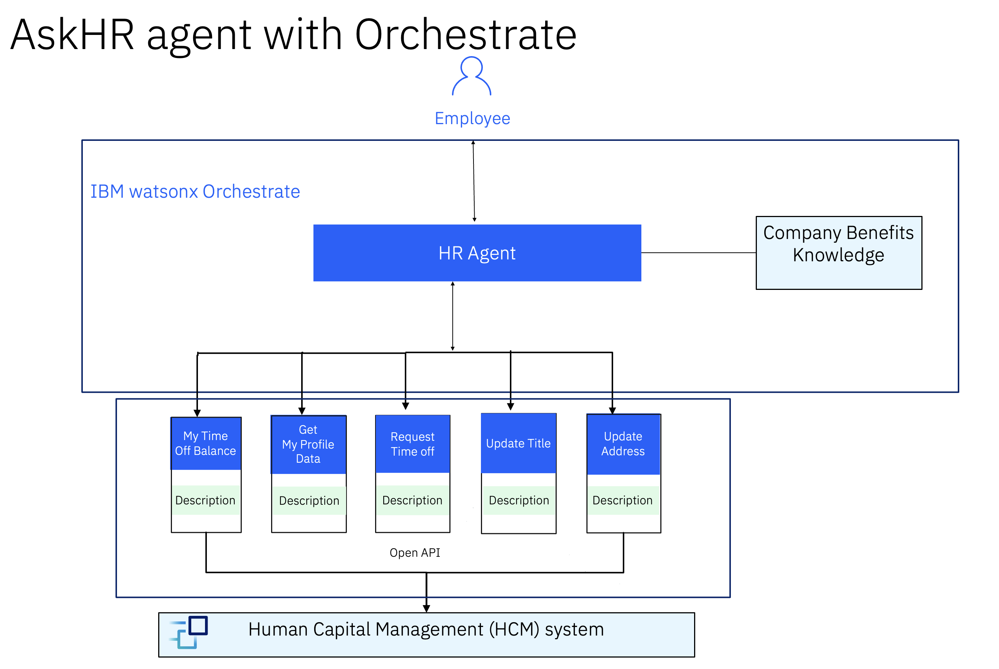

---

## Instrucciones

### Paso 1: Abrir Agent Builder

1. Bienvenido a watsonx Orchestrate. Abrí el menú lateral (ícono de hamburguesa).
2. Hacé click en **Crear**.

   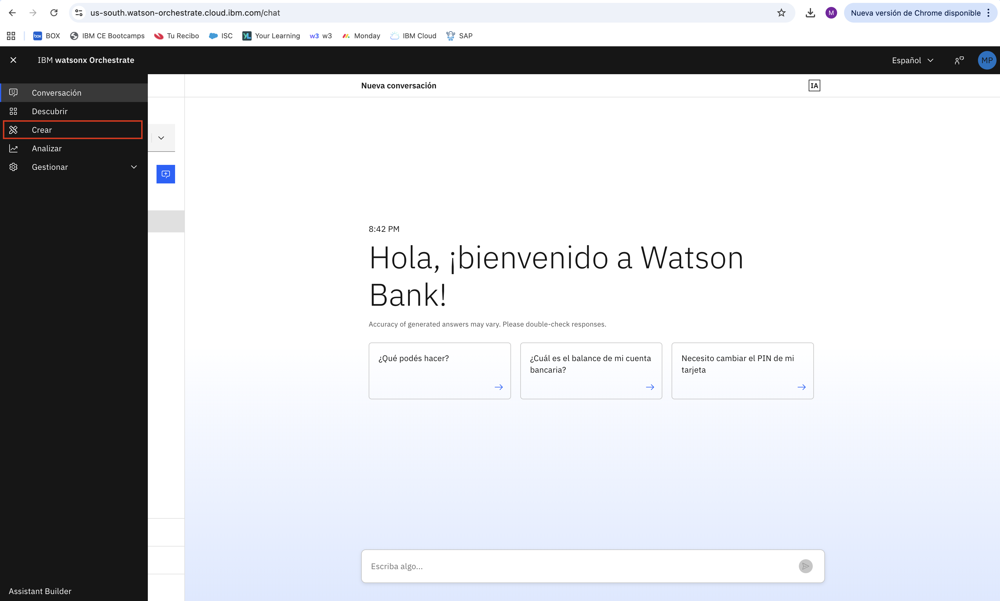

---

### Paso 2: Crear el Agente de RRHH

#### 2.1. Iniciar la creación del agente

1. Hacé click en **Crear agente +**:

   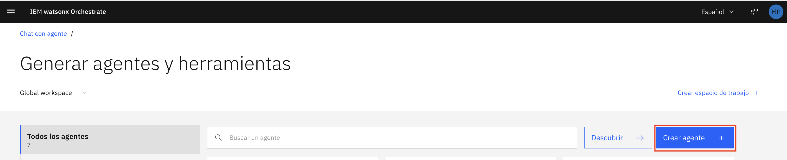

2. Seleccioná **Crear desde cero**.
3. Asignale un nombre a tu agente, por ejemplo: `Agente de HR`.
4. Completá la **Descripción** con el siguiente texto:

   ```
   Sos un agente que gestiona consultas de RRHH de empleados. Proporcionás respuestas cortas y claras, manteniendo la salida en 200 palabras o menos. Podés ayudar a los usuarios a consultar sus datos de perfil, obtener su saldo de vacaciones actualizado, actualizar su cargo o dirección y solicitar tiempo libre. También podés responder preguntas generales sobre los beneficios de la empresa.
   ```

5. Hacé click en **Crear**:

   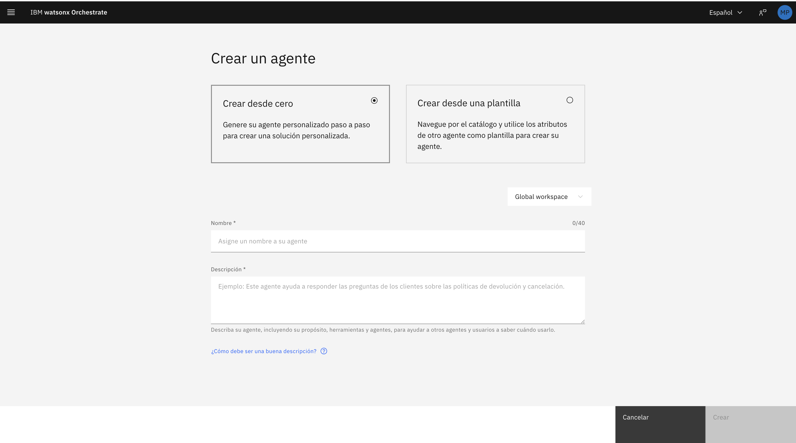

#### 2.2. Configurar el estilo del agente

1. En la sección **Estilo de agente**, seleccioná **Default** o **Valor predeterminado**:

   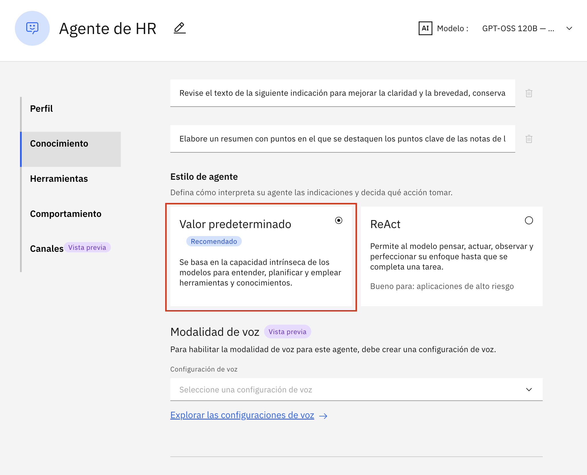

#### 2.3. Agregar base de conocimiento

1. Desplazate hacia abajo hasta la sección **Conocimiento**.
2. Hacé click en **Añadir origen**:

   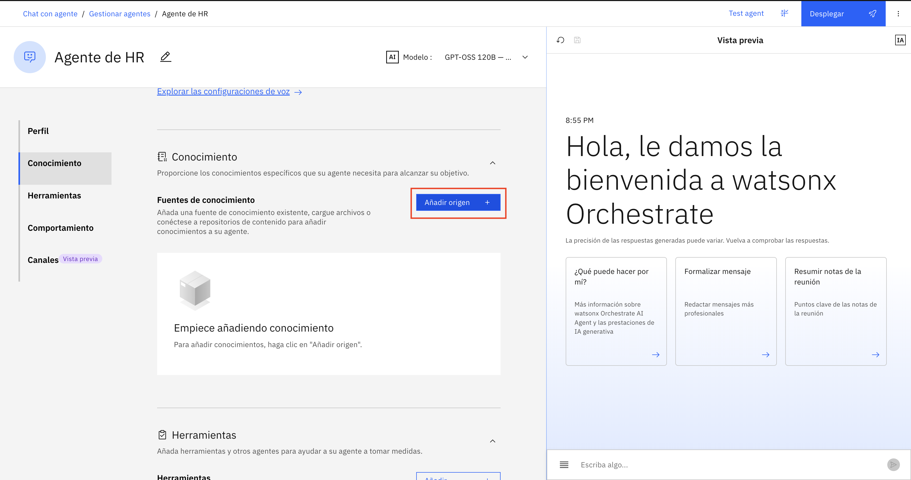

3. Seleccióna **Nuevos Conocimientos**.
4. Seleccioná **Cargar archivos**.
5. Hacé click en **Siguiente**:

   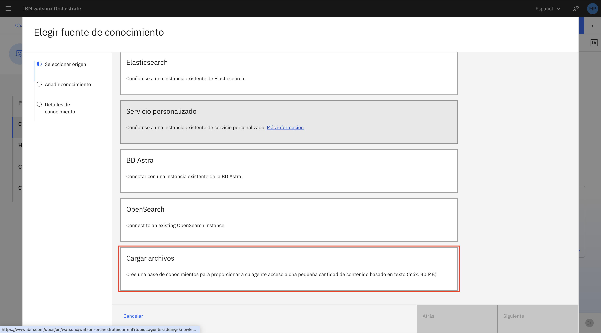

6. Descargá el archivo [Employee Benefits.pdf](Employee-Benefits.pdf) en tu equipo.
   - Podés descargarlo haciendo click en el enlace y luego en el ícono de descarga en la página que se abre:

   

7. Subí el archivo descargado.
8. Una vez cargado, hacé click en **Siguiente**:

   

9. Copiá la siguiente descripción en la sección **Descripción** y dale un nombre a la base de conocimiento:

   ```
   Esta base de conocimiento aborda los beneficios para empleados de la empresa, incluyendo licencias por paternidad/maternidad, política de mascotas, modalidades de trabajo flexible y pago de préstamos estudiantiles.
   ```

10. Hacé click en **Guardar**:

   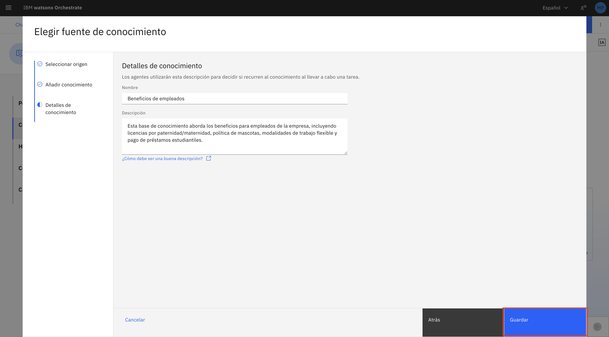

#### 2.4. Agregar herramientas

1. Desplazate hacia abajo hasta la sección **Herramientas**.
2. Hacé click en **Añadir herramienta +**:

   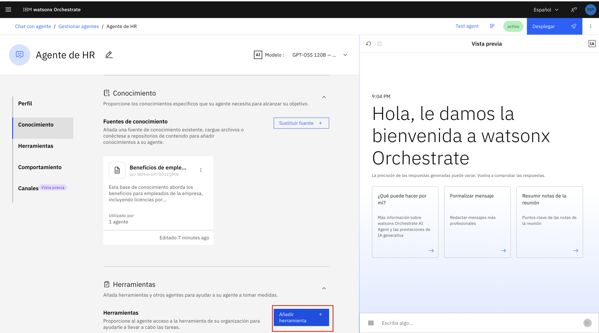

3. Seleccioná **OpenAPI**:

   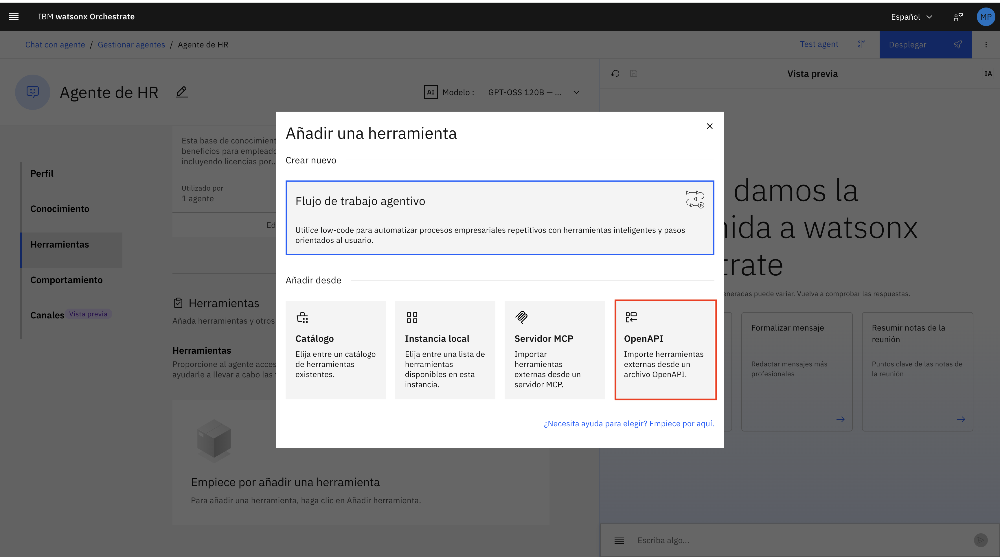

4. Subí el sigueinte archivo [hr.yaml](hr.yaml)
5. Hacé click en **Siguiente**
6. Seleccioná todas las operaciones disponibles y  hacé click en **Terminado**:

   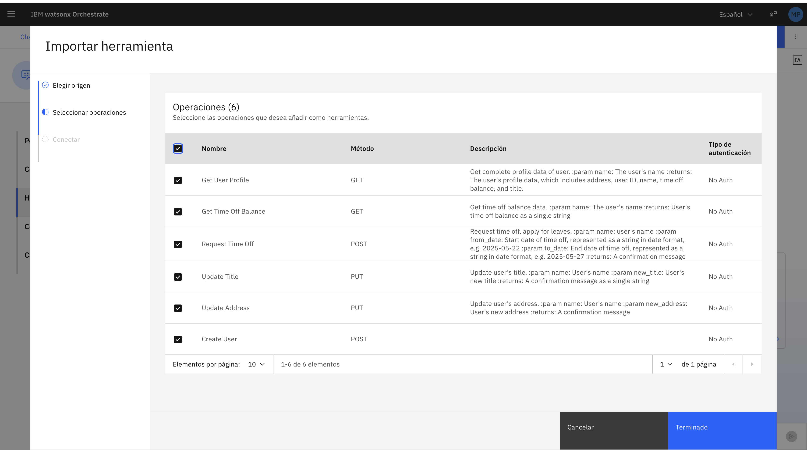

#### 2.5. Configurar el comportamiento del agente

1. Desplazate hacia abajo hasta la sección **Comportamiento**.
2. Insertá las siguientes instrucciones:

   ```
   Usá la base de conocimiento para responder preguntas generales sobre beneficios de empleados.

   Usá las herramientas para obtener o actualizar información específica del usuario.

   Cuando el usuario solicite ver datos de perfil, consultar saldo de vacaciones, actualizar cargo/dirección o solicitar tiempo libre por primera vez, primero pedile su nombre, luego invocá la herramienta y usá ese mismo nombre durante toda la sesión sin volver a pedirlo.

   Cuando el usuario solicite tiempo libre, convertí las fechas al formato YYYY-MM-DD. Por ejemplo, 6/22/2026 debe convertirse a 2026-06-22 antes de pasarlo a la herramienta post_request_time_off.
   ```

#### 2.6. Desplegar el agente

1. Dejá el resto de las configuraciones por defecto.
2. Hacé click en **Desplegar** en la esquina superior derecha para desplegar tu agente:

   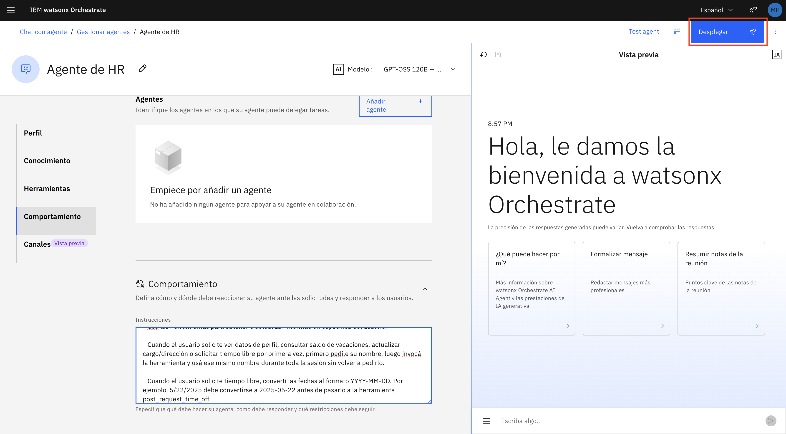

3. Hacé click en **Desplegar**.

   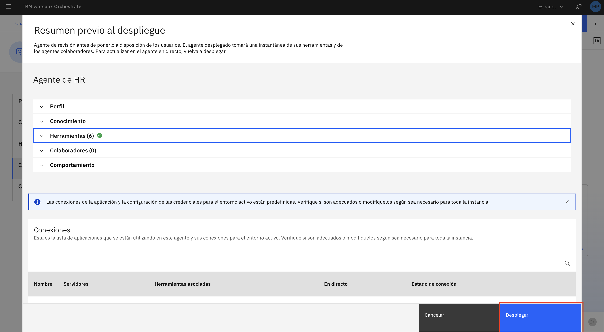

---

### Paso 3: Probar el Agente en Vista Previa

#### Preparación

Antes de comenzar las pruebas, seleccioná un nombre de empleado de la lista provista por tu instructor y usalo durante toda la sesión.

#### Pruebas sugeridas

Probá tu agente en el chat de vista previa (lado derecho) con las siguientes consultas. Las respuestas deberían ser similares a las mostradas en las imágenes:

1. **Consultar política de mascotas:**
   ```
   ¿Cuál es la política de mascotas?
   ```
   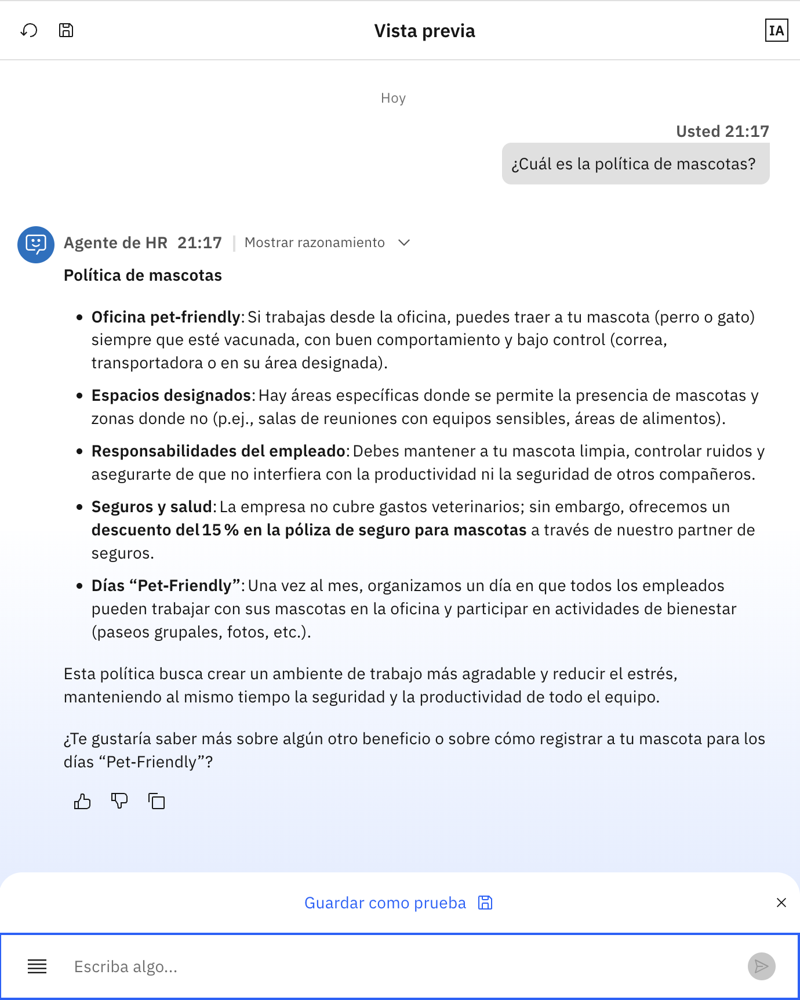

2. **Ver datos de perfil:**
   ```
   Mostrame mis datos de perfil.
   ```
   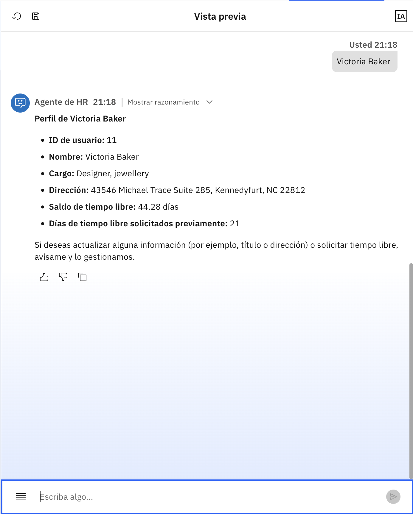

3. **Actualizar cargo:**
   ```
   Quiero actualizar mi cargo a "Sr AI engineer".
   ```
   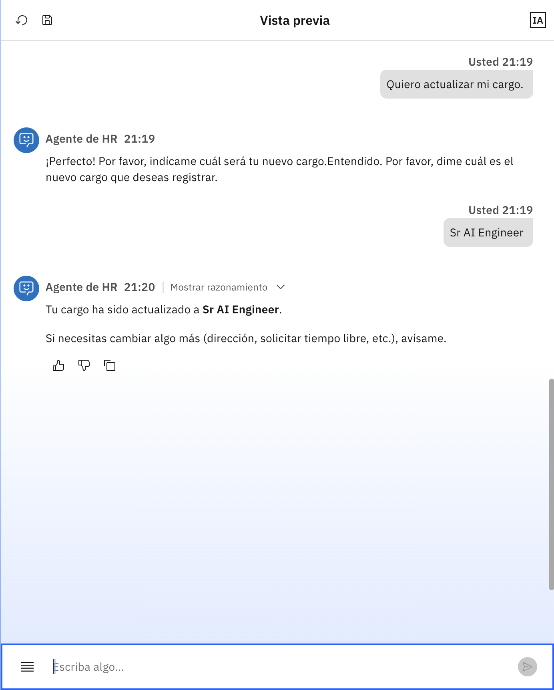

4. **Consultar saldo de vacaciones:**
   ```
   ¿Cuál es mi saldo de tiempo libre?
   ```
   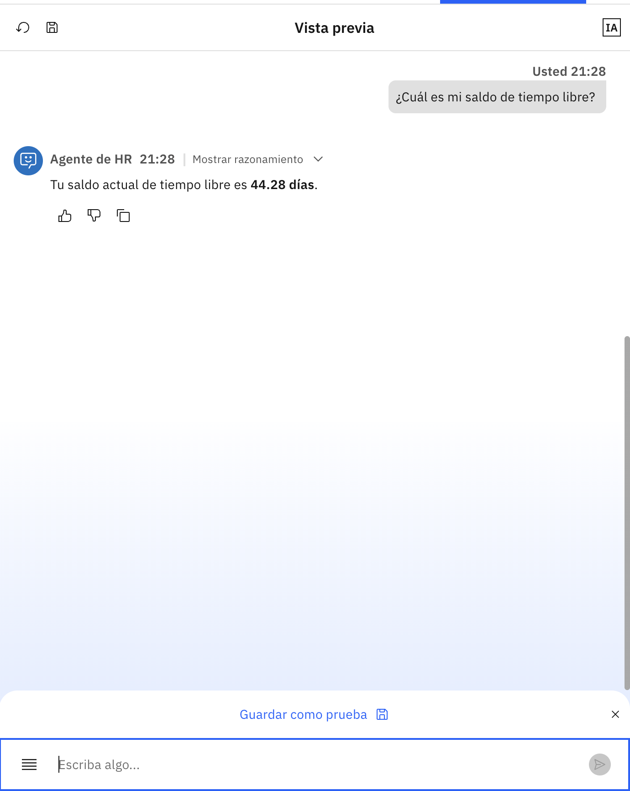

5. **Solicitar tiempo libre:**
   ```
   Solicitar tiempo libre
   ```
   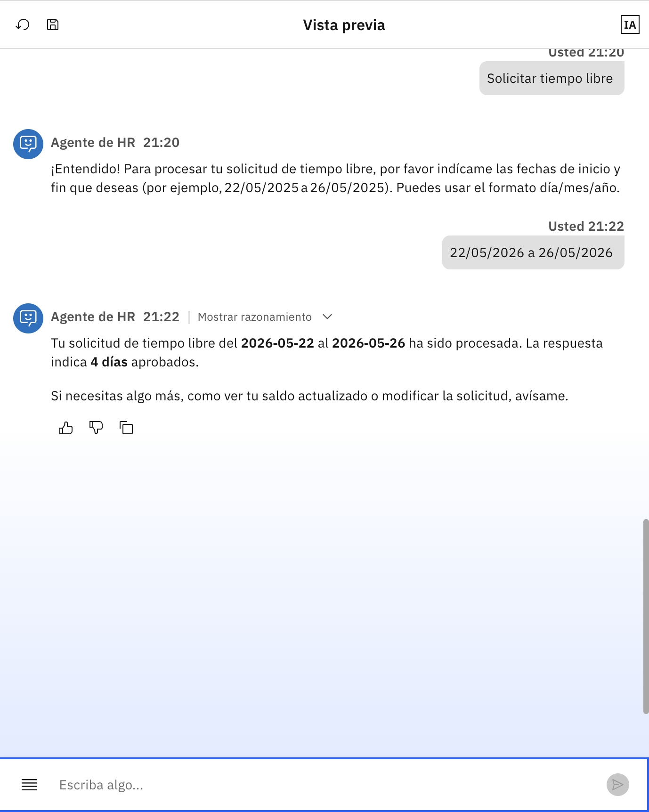

6. **Verificar cambios en el perfil:**
   ```
   Mostrame mis datos de perfil.
   ```
   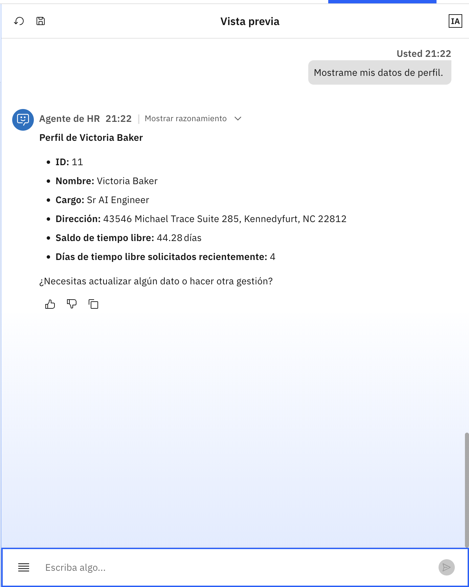

7. ¡También puedes consultar por tu dirección y actualizarla!

---

### Paso 4: Probar el Agente en AI Chat

1. Hacé click en el menú hamburguesa (arriba a la izquierda).
2. Seleccioná **Conversación**:

   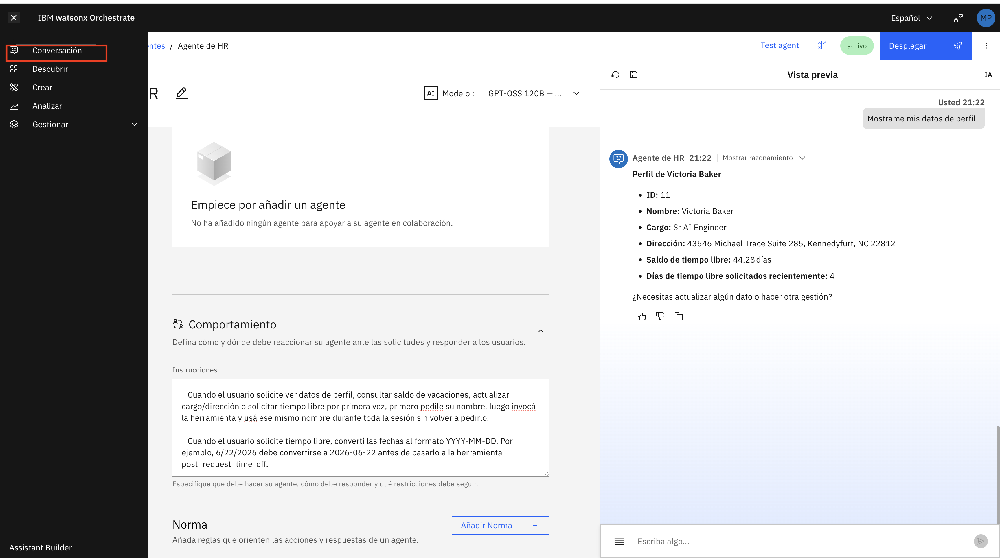

3. Asegurate de que esté seleccionado **Agente de HR**.
4. Ahora podés probar tu agente con las mismas consultas del paso anterior.

---

## ¡Felicitaciones!

Has completado exitosamente la creación y prueba de tu agente de RRHH en watsonx Orchestrate. Este agente ahora puede ayudar a los empleados a gestionar sus consultas de recursos humanos de manera eficiente y conversacional.
