# Lab 1 — IA agéntica con Confluent y watsonx Orchestrate

<figure class="wh-lab-group-banner">
  
</figure>

En este laboratorio vas a construir un sistema multiagente para asistir a **Las Marías**, empresa líder en producción de yerba mate argentina con su marca insignia **Rosamonte**. El sistema combina eventos de inventario en tiempo real provistos por Confluent Cloud, un catálogo visual de productos servido desde Code Engine y análisis competitivo mediante web scraping, todo orquestado con agentes de IA creados en IBM watsonx Orchestrate.

El objetivo es que los agentes puedan responder consultas de disponibilidad de productos, recomendar visualmente desde un catálogo estructurado, analizar competidores del mercado de yerba mate y coordinar estas capacidades para asistir tanto a equipos comerciales como a canales digitales.

## Qué vas a construir

Durante el lab vas a crear y probar tres agentes especializados:

1. **Inventory Availability Agent**: consulta disponibilidad de productos Las Marías en tiempo real usando una herramienta MCP conectada a Kafka y ksqlDB. Orientado a uso interno.
2. **Competitive Intelligence Agent**: analiza competidores del mercado de yerba mate mediante web scraping en tiempo real para mantener competitividad. Orientado a uso interno.
3. **Product Visual Advisor Agent**: asesor conversacional de productos para clientes finales. Recomienda yerba mate con imágenes mediante un proceso de preguntas y respuestas.

Además, vas a crear un agente orquestador:

4. **Las Marías Commercial Orchestrator**: asistente comercial interno que coordina los agentes de inventario y competencia para ayudar a empleados de Las Marías en decisiones operativas.


## Conseguí el código primero

Descargá el bundle del workshop y descomprimilo — se crea la carpeta `Labs-tech-summit/`. Los agentes, la herramienta MCP y los datos de este lab viven en `Labs-tech-summit/Lab2/confluent_agents/`.

[:material-download: Bundle del workshop (4.9 MB)](../downloads/agentic-retail-workshop.zip){ .md-button .md-button--primary download="agentic-retail-workshop.zip" }

## Estructura general del flujo

El lab avanza de menor a mayor complejidad:

1. Primero se configura el entorno local, IBM Cloud, watsonx Orchestrate y Confluent Cloud.
2. Luego se importa una herramienta MCP para consultar disponibilidad de productos.
3. Después se crea un agente visual que recomienda productos desde un catálogo estructurado.
4. Se agrega un agente de inteligencia competitiva que usa web scraping en tiempo real.
5. Finalmente se crea un agente orquestador que combina las tres capacidades y entrega respuestas orientadas al negocio.

## Prerrequisitos

Antes de comenzar, completá esta sección.

[Ir a la guía de prerrequisitos :octicons-arrow-right-24:](../requisitos-previos/index.md){ .md-button .md-button--primary }

### 1. Crear una IBM Cloud API Key

Necesitás una API Key de IBM Cloud para autenticarte con watsonx Orchestrate desde el ADK.

1. Iniciá sesión en IBM Cloud: [https://cloud.ibm.com/login](https://cloud.ibm.com/login)
2. En el menú **Gestionar**, seleccioná **Acceso (IAM)**.

   
3. En el menú **Claves de API**, hacé clic en **Crear**.

   
4. Ingresá un nombre para la API Key.

   
5. Hacé clic en **Crear**.
6. Copiá y guardá la API Key en un lugar seguro.

!!! warning "Importante"
    No vas a poder ver la API Key nuevamente después de cerrar la ventana. Tratala como una contraseña y no la compartas públicamente.

### 2. Instalar y configurar el ADK de watsonx Orchestrate

El **Agent Development Kit (ADK)** permite importar herramientas y agentes en watsonx Orchestrate desde la línea de comandos.

#### 2.1. Obtener la URL de watsonx Orchestrate

1. Accedé al dashboard de IBM Cloud: [https://cloud.ibm.com](https://cloud.ibm.com)
2. Abrí el menú de hamburguesa.

   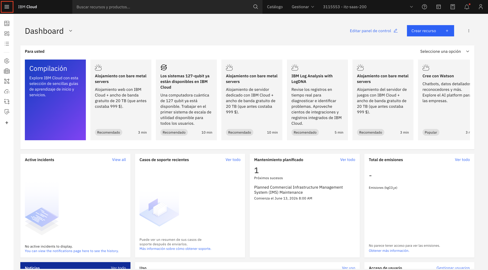
3. Seleccioná **Lista de recursos**.

   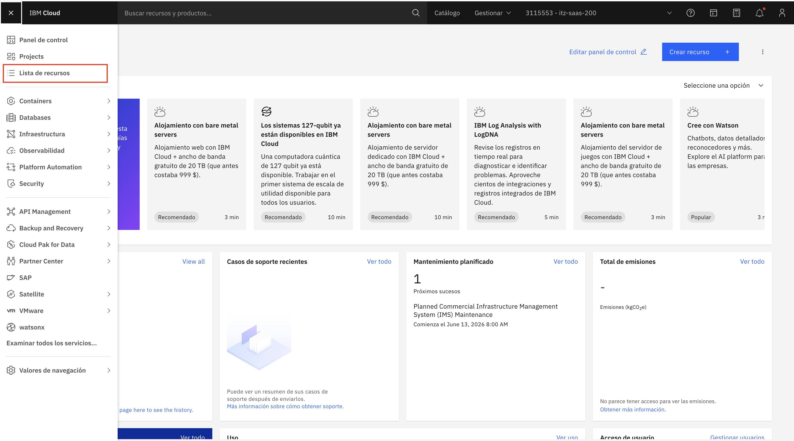
4. Seleccioná tu instancia de **watsonx Orchestrate** dentro de **IA / Aprendizaje automático**.

   
5. Copiá la URL de la instancia.

   

#### 2.2. Instalar el ADK

Abrí una terminal nueva. Hacé click en **Terminal** -> **New terminal** en la esquina superior izquierda:

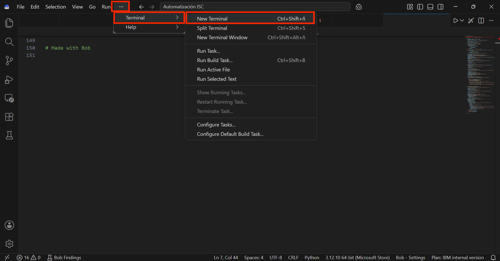

Asegurate de estar posicionado en la carpeta raíz del workshop: `Labs-tech-summit/`.

```bash
cd Labs-tech-summit
```

Luego ejecutá:

```bash
pip install --upgrade ibm-watsonx-orchestrate
```

#### 2.3. Crear un ambiente del ADK

El ADK usa ambientes para gestionar conexiones a distintas instancias de watsonx Orchestrate.

```bash
orchestrate env add -n <nombre_del_ambiente> -u <url_instancia_wxo>
```

Reemplazá:

- `<nombre_del_ambiente>` por un nombre descriptivo, por ejemplo `labtech`.
- `<url_instancia_wxo>` por la URL de tu instancia de watsonx Orchestrate.

#### 2.4. Activar el ambiente

Ejecutá:

```bash
orchestrate env activate <nombre_del_ambiente>
```

Cuando se solicite, ingresá la IBM Cloud API Key que creaste previamente.

!!! warning "Importante"
    Guardá el nombre del ambiente. Si el token expira durante el lab, vas a necesitar activarlo nuevamente. Al final del documento hay una sección de troubleshooting con el comando correspondiente.

Para más información, podés consultar la [documentación oficial del ADK](https://developer.watson-orchestrate.ibm.com/getting_started/installing).


### 3. Posicionate en la carpeta de Lab 2

Usá la terminal que abriste antes y posicionate en la carpeta que contiene los agentes, herramientas y archivos de datos.

Si estás en la raíz del proyecto (`Labs-tech-summit/`):

```bash
cd Lab2
```

## Paso 1 — Crear la herramienta MCP y el agente de disponibilidad

En este paso vas a crear el primer agente del lab: **Inventory Availability Agent**. Este agente consulta la disponibilidad de productos Las Marías en tiempo real a través de una herramienta MCP conectada a Confluent.

### Objetivo del paso

Al finalizar este paso, vas a tener:

- Una herramienta MCP registrada en watsonx Orchestrate.
- Un agente capaz de invocar esa herramienta.
- Una primera prueba de disponibilidad de inventario funcionando desde la UI.

### 1.1. Importar la herramienta MCP

Una herramienta MCP expone una función externa para que un agente pueda invocarla. En este caso, la herramienta ejecuta `get_sku_availability.py`, que consulta disponibilidad de inventario usando Kafka y ksqlDB.

Desde `Lab2`, ejecutá:

```bash
orchestrate toolkits add --kind mcp --name "sku-availability-checker" --description "Verificador de disponibilidad de inventario Las Marías en tiempo real usando Confluent Kafka y ksqlDB" --language python --package-root "confluent_agents" --command "python get_sku_availability.py" --tools "get_sku_availability"
```

### 1.2. Importar el agente de disponibilidad

El archivo `Inventory_Availability_Agent.yaml` define el comportamiento del agente, su descripción y la herramienta que puede usar.

Ejecutá:

```bash
orchestrate agents import -f confluent_agents/Inventory_Availability_Agent.yaml
```

!!! note "Nota"
    Si después de importar el agente no lo ves en la UI de watsonx Orchestrate, recargá la página.

### 1.3. Acceder a watsonx Orchestrate

Si todavía no tenés abierta la interfaz:

1. Accedé al dashboard de IBM Cloud: [https://cloud.ibm.com](https://cloud.ibm.com)
2. Abrí el menú de hamburguesa.
3. Seleccioná **Lista de recursos**.
4. Seleccioná tu instancia de **watsonx Orchestrate**.
5. Hacé clic en **Iniciar watsonx Orchestrate**.

   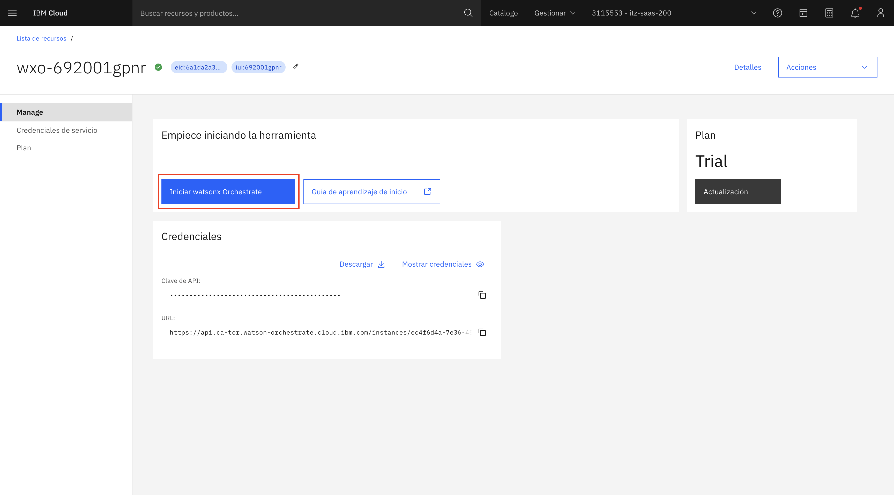
6. En la UI, ingresá a **Build**.

   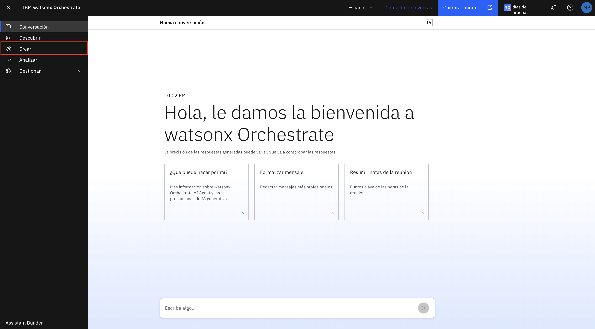

### 1.4. Desplegar el agente

1. Buscá el agente `Inventory_Availability_Agent`.
2. Abrilo desde la lista de agentes.

   
3. En la esquina superior derecha, hacé clic en **Deploy**.

   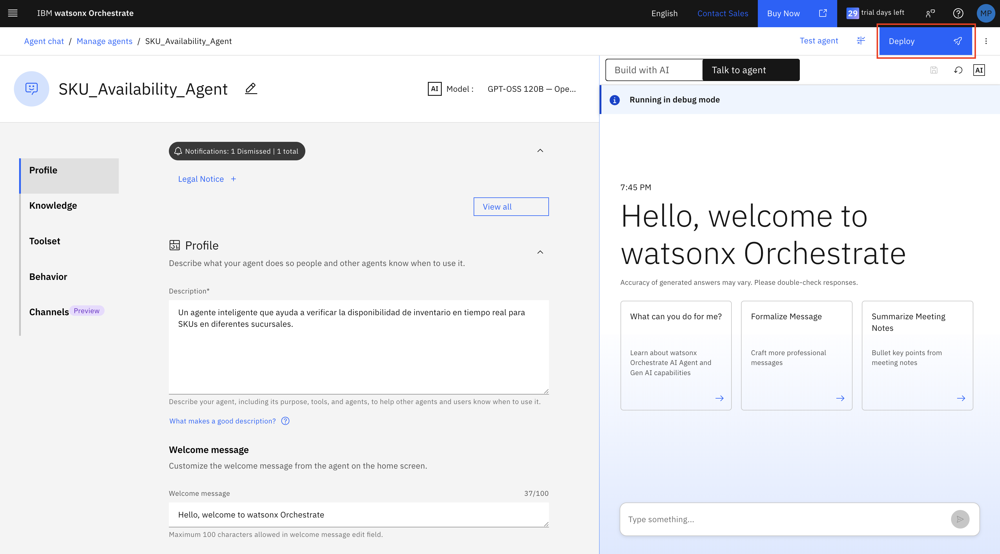
4. Confirmá el despliegue en la ventana de resumen.

   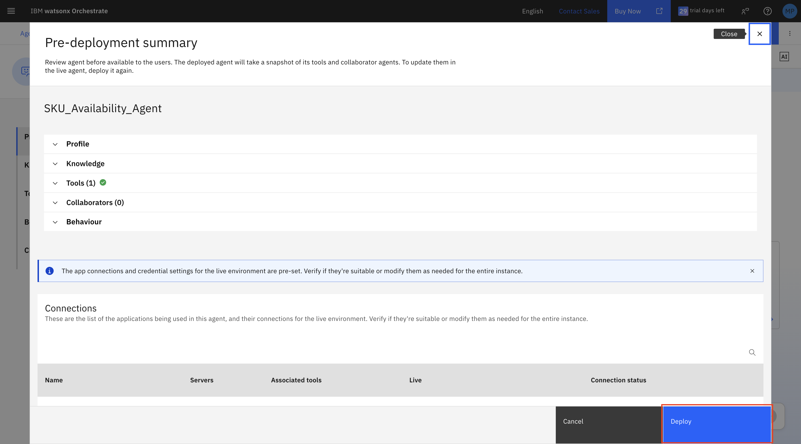

### 1.5. Probar el agente

Usá una pregunta como esta:

```text
¿Hay stock de Rosamonte Especial 1kg en Tienda Online?
```

!!! tip "Resultado esperado"
    El agente devuelve la disponibilidad actual del producto para el canal indicado y marca si está sin stock cuando corresponda.

Probá también:

```text
¿Qué productos Rosamonte están disponibles en Distribuidor AMBA?
```

!!! note "Nota"
    Los nombres de canales dependen de los datos cargados en Confluent. En los datos de muestra de este repositorio aparecen: `Tienda Online`, `Distribuidor AMBA`, `Distribuidor NEA`, `Centro de Distribución Buenos Aires` y `Centro de Distribución Corrientes`.

## Paso 2 — Crear el agente visual de productos

En este paso vas a crear el **Product Visual Advisor Agent**. Este agente actúa como asesor conversacional de productos para clientes finales, recomendando yerba mate con imágenes mediante un proceso de preguntas y respuestas.

### Objetivo del paso

Al finalizar este paso, vas a tener:

- Un agente conversacional orientado a clientes finales en canales digitales.
- Capacidad de recopilar preferencias del usuario mediante preguntas.
- Recomendaciones personalizadas con imágenes de productos.
- Manejo de valores por defecto cuando el usuario no responde.

### 2.1. Importar el agente

Desde `Lab2`, ejecutá:

```bash
orchestrate agents import -f confluent_agents/Product_Visual_Advisor_Agent.yaml
```

!!! note "Nota"
    Si el agente no aparece después de importarlo, recargá la UI de watsonx Orchestrate.

### 2.2. Desplegar el agente

1. Abrí el agente `Product_Visual_Advisor_Agent`.
2. En la esquina superior derecha, hacé clic en **Deploy**.
3. Confirmá el despliegue en la ventana de resumen.

### 2.3. Entender el proceso conversacional del agente

El agente Product Visual Advisor Agent está diseñado para interactuar con clientes finales mediante un proceso conversacional:

**Flujo de interacción:**

1. **Usuario hace una consulta inicial**: "Quiero una yerba para empezar a tomar mate"
2. **Agente hace preguntas para recopilar preferencias**:
   - ¿Preferís una yerba suave, media o intensa?
   - ¿Te gusta la yerba con palo o sin palo (despalada)?
   - ¿Sos principiante o ya tomás mate habitualmente?
3. **Agente llama a la herramienta** con las preferencias recopiladas
4. **Agente presenta la recomendación** con imagen y explicación

**Manejo de valores por defecto:**

Si el usuario no responde alguna pregunta o dice "no sé", el agente usa valores por defecto:
- Intensidad: suave
- Con palo: sí (con palo)
- Experiencia: principiante

**Productos del catálogo:**

**Marca Rosamonte:**
- **Rosamonte Tradicional 1kg**: Intenso, con palo, molienda media. Para consumidores habituales.
- **Rosamonte Especial 1kg**: Suave, menos palo, molienda fina. Para principiantes.
- **Rosamonte Despalada 1kg**: Intenso, sin palo, molienda fina. Para quienes buscan intensidad sin palo.
- **Rosamonte Suave 500g**: Extra suave, con palo. Ideal para iniciarse en el mate.

**Marca Amanda:**
- **Amanda Tradicional 1kg**: Equilibrado, con palo, molienda media.
- **Amanda Especial 500g**: Suave, menos palo, molienda fina.

!!! warning "Importante"
    Este agente NO usa RAG. Trabaja con un catálogo estructurado servido desde Code Engine. No inventa productos ni imágenes. Está orientado a clientes finales, no a empleados internos.

### 2.4. Probar el agente con proceso conversacional

Probá una consulta inicial para principiantes:

```text
Quiero una yerba para empezar a tomar mate
```

!!! tip "Resultado esperado"
    El agente te hace la primera pregunta: "¿Preferís una yerba suave, media o intensa?"
    
Respondé:

```text
Suave
```

!!! tip "Resultado esperado"
    El agente te hace la segunda pregunta: "¿Te gusta la yerba con palo o sin palo (despalada)?"

Respondé:

```text
Con palo
```

!!! tip "Resultado esperado"
    El agente presenta la recomendación final con imagen del producto (probablemente Rosamonte Suave o Rosamonte Especial).

Probá ahora una consulta donde no respondés todas las preguntas:

```text
Necesito una yerba
```

Cuando el agente pregunte por intensidad, respondé:

```text
No sé
```

!!! tip "Resultado esperado"
    El agente usa el valor por defecto (suave) y continúa con la siguiente pregunta o presenta una recomendación.

## Paso 3 — Crear el agente de inteligencia competitiva

En este paso vas a crear el **Competitive Intelligence Agent**. Este agente actúa como analista de mercado senior de Rosamonte, investigando competidores del mercado de yerba mate argentino en tiempo real mediante web scraping.

### Objetivo del paso

Al finalizar este paso, vas a tener:

- Un agente especializado en análisis competitivo del mercado de yerba mate.
- Capacidad de investigar competidores en tiempo real usando web scraping.
- Recomendaciones de productos Rosamonte basadas en análisis de mercado actualizado.

### 3.1. Importar el agente

Desde `Lab2`, ejecutá:

```bash
orchestrate agents import -f confluent_agents/Competitive_Intelligence_Agent.yaml
```

!!! note "Nota"
    Si el agente no aparece después de importarlo, recargá la UI de watsonx Orchestrate.

### 3.2. Crear la conexión Exa con el ADK

Antes de agregar las herramientas MCP de Exa, necesitás crear una conexión que permita al agente autenticarse con el servicio de Exa. Esta conexión se crea usando el ADK desde la línea de comandos.

!!! info "API Key de Exa"
    Durante el workshop, se te proporcionará una API Key de Exa para usar en este paso. Si estás haciendo el lab por tu cuenta, podés obtener tu propia API Key registrándote en [https://exa.ai](https://exa.ai).

#### 3.2.1. Ejecutar el comando para crear la conexión

Desde la carpeta `Lab2`, ejecutá el siguiente comando reemplazando `TU_API_KEY_DE_EXA` con la API Key que te proporcionaron:

```bash
orchestrate connections set-credentials -a Exa \
  --env draft \
  --api-key TU_API_KEY_DE_EXA
```

!!! note "Parámetros del comando"
    - `-a Exa`: Especifica el nombre de la aplicación/conexión como "Exa"
    - `--env draft`: Configura las credenciales para el ambiente draft (usado en Manage Agents preview)
    - `--api-key`: La API Key de Exa para autenticación

#### 3.2.2. Verificar la conexión creada

Podés verificar que la conexión se creó correctamente ejecutando:

```bash
orchestrate connections list
```

Deberías ver la conexión "Exa" en la lista de conexiones disponibles.

!!! success "Conexión lista"
    Una vez creada la conexión, ya podés proceder a agregar las herramientas MCP de Exa al agente.

### 3.3. Agregar las herramientas MCP de Exa desde el catálogo

El agente de inteligencia competitiva necesita herramientas de web scraping para investigar el mercado en tiempo real. watsonx Orchestrate proporciona estas herramientas a través del servidor MCP de Exa en su catálogo.

!!! info "¿Qué es Exa MCP?"
    Exa MCP es un servidor que permite a los agentes de IA buscar en la web, obtener contenido de páginas y encontrar ejemplos de código en tiempo real. Proporciona dos herramientas principales:
    
    - **web_search_exa**: Busca en la web y obtiene contenido limpio y listo para usar
    - **web_fetch_exa**: Lee el contenido completo de una página web como markdown limpio

#### 3.3.1. Acceder al agente en watsonx Orchestrate

1. En la UI de watsonx Orchestrate, abrí el agente `Competitive_Intelligence_Agent`.
2. En el menú lateral izquierdo, seleccioná **Toolset**.

   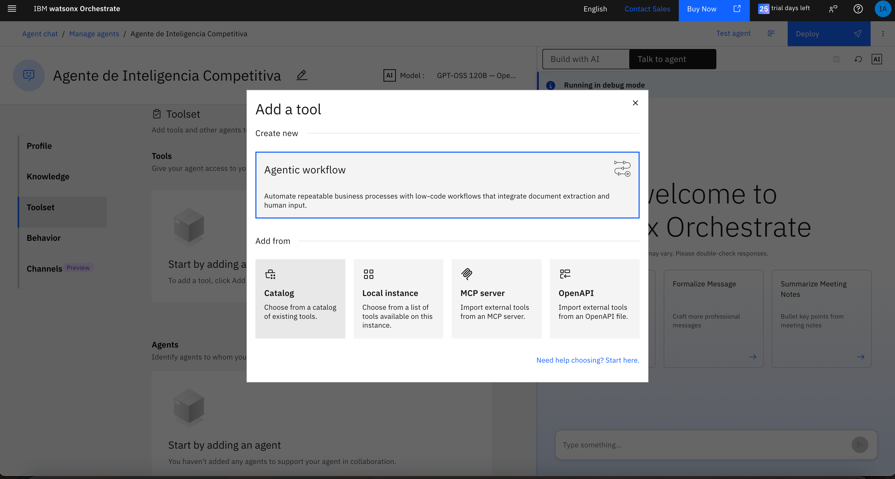

#### 3.3.2. Iniciar la búsqueda de herramientas

1. En la sección **Tools**, hacé clic en el botón **Add tool** (+ Add tool).

   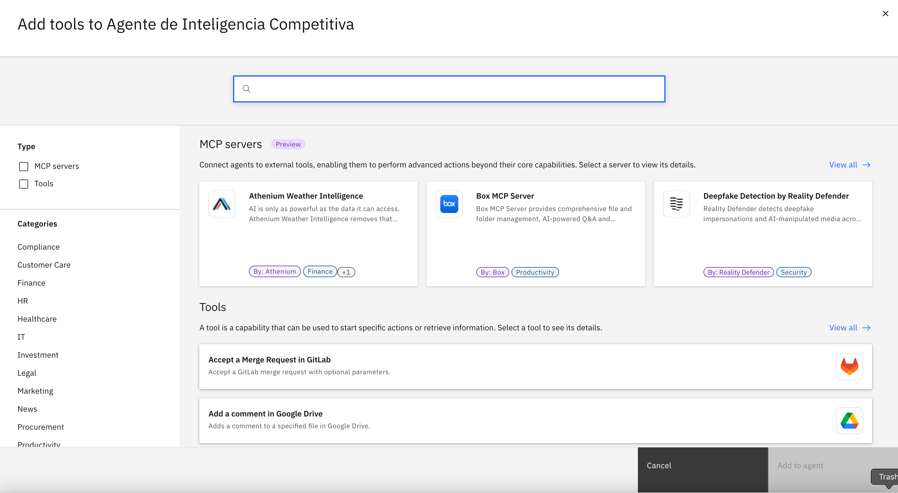

2. En el modal que aparece, seleccioná la opción **Catalog**.

   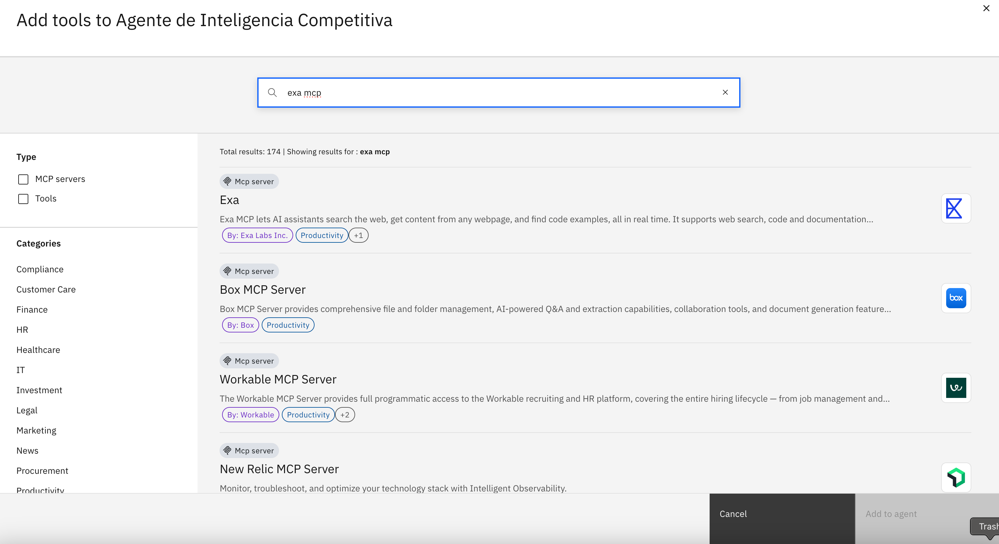

#### 3.3.3. Buscar el servidor MCP de Exa

1. En el campo de búsqueda, escribí `exa mcp`.

   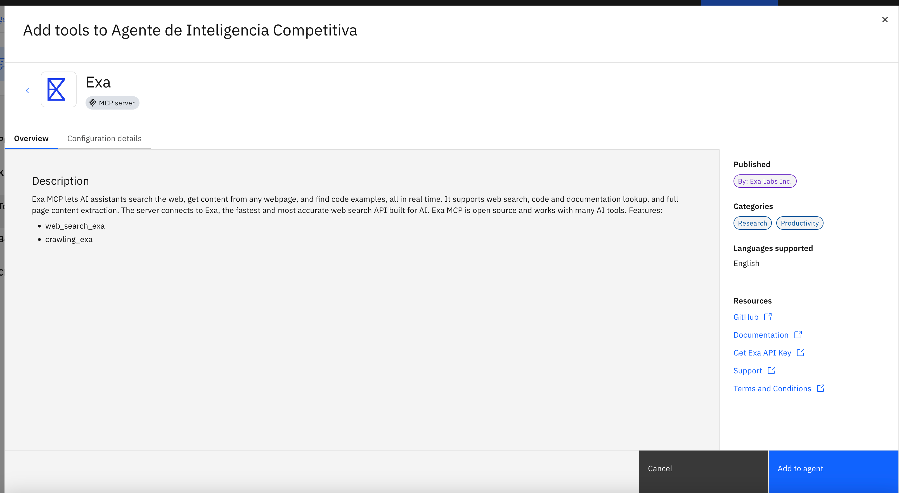

2. En los resultados, seleccioná el primer elemento: **Exa** (publicado por Exa Labs Inc.).

   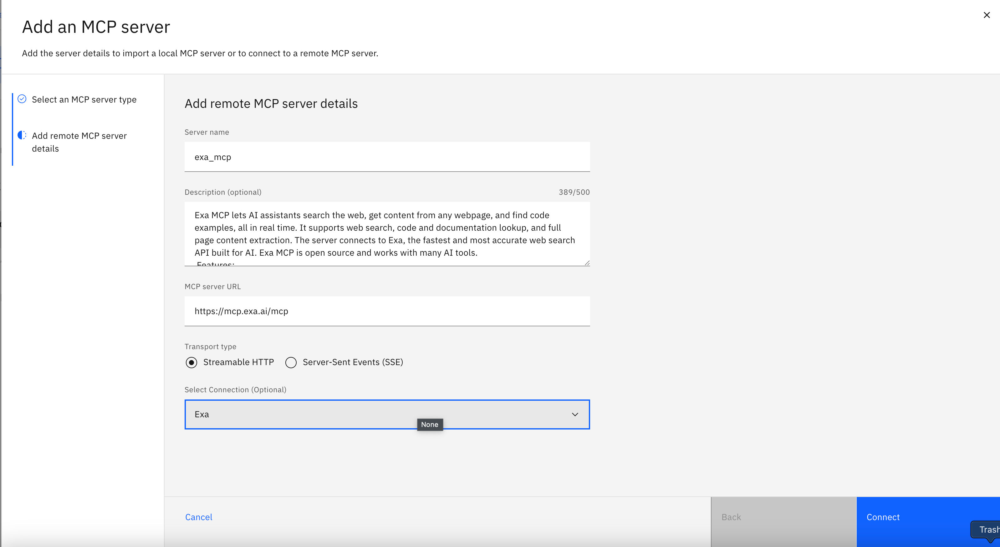

3. Hacé clic en el botón **Add to agent**.

#### 3.3.4. Configurar la conexión

1. En la pantalla de configuración del servidor MCP, completá los siguientes campos:

   - **Server name**: `exa_mcp` (ya viene precargado)
   - **Description**: La descripción del servidor ya está incluida
   - **MCP server URL**: `https://mcp.exa.ai/mcp` (ya viene precargado)
   - **Transport type**: Seleccioná **Streamable HTTP** (ya viene seleccionado)

2. En el campo **Select Connection (Optional)**, seleccioná **Exa** del menú desplegable.

   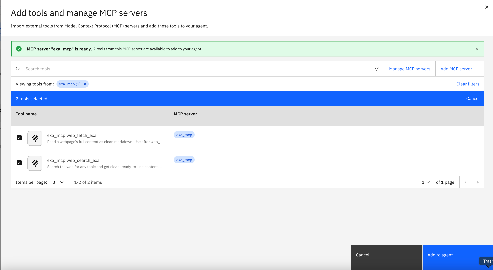

   !!! note "Nota"
       La conexión "Exa" debería estar disponible si completaste el paso 3.2 correctamente. Si no aparece, verificá que ejecutaste el comando `orchestrate connections set-credentials` correctamente.

3. Hacé clic en el botón **Connect**.

#### 3.3.5. Seleccionar las herramientas

1. En la pantalla de selección de herramientas, vas a ver dos opciones disponibles:

   - `exa_mcp:web_fetch_exa` - Lee el contenido completo de una página web
   - `exa_mcp:web_search_exa` - Busca en la web y obtiene contenido limpio

   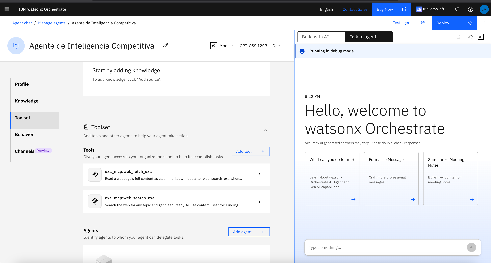

2. Seleccioná **ambas herramientas** marcando sus checkboxes.

3. Hacé clic en el botón **Add to agent**.

#### 3.3.6. Verificar las herramientas agregadas

1. Deberías ver un mensaje de confirmación indicando que el servidor MCP "exa_mcp" está listo con 2 herramientas disponibles.

   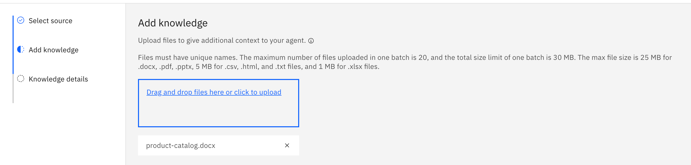

2. En la sección **Tools** del agente, verificá que aparezcan las dos herramientas:
   - `exa_mcp:web_fetch_exa`
   - `exa_mcp:web_search_exa`

3. Guardá los cambios si es necesario.

!!! success "¡Listo!"
    El agente ahora tiene acceso a las herramientas de web scraping necesarias para analizar el mercado de yerba mate en tiempo real.

### 3.4. Desplegar el agente

1. Volvé a la vista principal del agente (si estás en Toolset, hacé clic en **Profile** en el menú lateral).
2. En la esquina superior derecha, hacé clic en **Deploy**.
3. Confirmá el despliegue en la ventana de resumen.

### 3.5. Entender las capacidades del agente

El agente Competitive Intelligence Agent tiene conocimiento profundo sobre:

**Productos Rosamonte:**

- **Rosamonte Tradicional**: Yerba mate con palo, molienda media, sabor intenso y duradero (~$2,500 ARS/kg)
- **Rosamonte Especial**: Yerba mate suave, molienda fina, menos palo (~$2,800 ARS/kg)
- **Rosamonte Despalada**: Sin palo, molienda fina, sabor concentrado (~$3,200 ARS/kg)
- **Rosamonte Suave**: Versión extra suave, ideal para iniciarse (~$1,500 ARS/500g)

**Competidores principales:**

- **Taragüi**: Marca líder, amplia distribución
- **CBSé**: Posicionamiento premium, variedades saborizadas
- **Playadito**: Segmento económico
- **Cruz de Malta**: Tradicional, fuerte presencia en AMBA
- **La Merced**: Premium, estacionamiento prolongado
- **Amanda**: Marca de Las Marías, posicionamiento medio

**Capacidades de análisis:**

- Investiga competidores usando web scraping en tiempo real
- Compara precios, molienda, sabor, origen y estacionamiento
- Analiza posicionamiento de mercado (premium, medio, económico)
- Genera recomendaciones basadas en análisis competitivo

!!! warning "Importante"
    El agente SIEMPRE usa web scraping para obtener información actualizada. Nunca inventa datos sobre competidores. Los precios obtenidos son referenciales y pueden variar según fecha, canal y disponibilidad.

### 3.6. Probar el agente

Probá una consulta de análisis competitivo general:

```text
¿Cuál es la mejor yerba mate del mercado argentino?
```

!!! tip "Resultado esperado"
    El agente investiga competidores en tiempo real, crea una tabla comparativa con datos reales de la web y recomienda un producto Rosamonte basándose en el análisis.

Probá una comparación específica:

```text
Compará Rosamonte con Taragüi y CBSé. ¿Cuál me conviene?
```

!!! tip "Resultado esperado"
    El agente busca información actualizada sobre las marcas mencionadas, compara características y precios, y recomienda el producto Rosamonte más adecuado con justificación basada en datos reales.

Probá una consulta para principiantes:

```text
Soy nuevo tomando mate, ¿qué yerba me recomendás?
```

!!! tip "Resultado esperado"
    El agente recomienda Rosamonte Especial o Rosamonte Suave (más suaves) y explica por qué es mejor que opciones económicas para empezar con calidad, comparando con alternativas del mercado.

## Paso 4 — Crear el agente orquestador

En este paso vas a crear el **Las Marías Commercial Orchestrator**. Este agente funciona como asistente comercial interno para empleados de Las Marías: recibe consultas operativas, coordina los agentes de inventario y competencia, y entrega respuestas integradas para decisiones de negocio.

### Objetivo del paso

Al finalizar este paso, vas a tener un agente que:

- Interpreta consultas de empleados internos.
- Coordina los agentes de inventario y competencia según la necesidad.
- Integra respuestas de múltiples agentes backend.
- Entrega respuestas claras orientadas a decisiones operativas.

### 4.1. Importar el agente orquestador

Desde `Lab2`, ejecutá:

```bash
orchestrate agents import -f confluent_agents/Las_Marias_Commercial_Orchestrator.yaml
```

!!! note "Nota"
    Si el agente no aparece después de importarlo, recargá la UI de watsonx Orchestrate.

### 4.2. Desplegar el agente

1. Abrí el agente `Las_Marias_Commercial_Orchestrator`.
2. En la esquina superior derecha, hacé clic en **Deploy**.
3. Confirmá el despliegue en la ventana de resumen.

### 4.3. Probar el agente con consultas operativas

Probá una consulta de disponibilidad:

```text
¿Hay Rosamonte Tradicional 1kg en Tienda Online?
```

!!! tip "Resultado esperado"
    El agente consulta disponibilidad y responde con el estado del producto en el canal indicado.

Probá una consulta de disponibilidad en múltiples canales:

```text
¿En qué canales tenemos stock de Rosamonte Especial 1kg?
```

!!! tip "Resultado esperado"
    El agente consulta disponibilidad en todos los canales y lista dónde hay stock disponible.

Probá una consulta competitiva:

```text
Compará Rosamonte Especial con T aragüi para preparar una presentación comercial
```

!!! tip "Resultado esperado"
    El agente analiza competidores mediante web scraping y entrega un análisis comparativo detallado.

### 4.4. Probar el agente con una consulta integral

Ahora probá una consulta que requiera coordinar ambos agentes backend:

```text
Necesito saber si tenemos Rosamonte Despalada en Distribuidor AMBA y cómo está posicionada frente a Cruz de Malta en el mercado.
```

!!! tip "Resultado esperado"
    El agente orquestador debe:
    
    1. Llamar al Inventory Availability Agent para verificar stock en Distribuidor AMBA
    2. Llamar al Competitive Intelligence Agent para comparar con Cruz de Malta
    3. Integrar toda la información en una respuesta clara que incluya:
       - Disponibilidad actual en el canal solicitado
       - Análisis competitivo con datos reales de la web
       - Recomendación comercial basada en ambos factores

Probá también una consulta de análisis de portafolio:

```text
¿Qué productos Amanda tenemos disponibles en Centro de Distribución Buenos Aires?
```

!!! tip "Resultado esperado"
    El agente consulta inventario y lista los productos Amanda disponibles en ese centro de distribución.


## Cierre del laboratorio

En este lab construiste un sistema de IA agéntica para Las Marías con dos experiencias diferenciadas:

### Experiencia Interna (Empleados)
**Las Marías Commercial Orchestrator** coordina:
- **Inventory Availability Agent**: Consulta inventario en tiempo real desde Confluent Cloud
- **Competitive Intelligence Agent**: Analiza competidores mediante web scraping con Exa MCP

Esta experiencia está orientada a empleados de Las Marías para decisiones operativas y análisis de mercado.

### Experiencia Externa (Clientes)
**Product Visual Advisor Agent** funciona de forma independiente:
- Proceso conversacional que recopila preferencias del cliente
- Recomendaciones personalizadas con imágenes desde Code Engine
- Manejo inteligente de valores por defecto

Esta experiencia está orientada a clientes finales en canales digitales.

### Tecnologías integradas
- **Confluent Cloud**: Datos operacionales en tiempo real con inventario de productos
- **Code Engine**: Catálogo visual estructurado con imágenes de productos
- **Exa MCP**: Web scraping para análisis competitivo en tiempo real
- **watsonx Orchestrate**: Plataforma para crear, coordinar y desplegar agentes especializados

El resultado es una arquitectura que separa claramente uso interno y externo, donde cada agente cumple una función específica y el sistema completo permite responder tanto consultas operativas como necesidades de clientes finales con contexto actualizado del mercado argentino de yerba mate.


## Troubleshooting

??? failure "Token expirado o faltante en el ADK"
    Si al ejecutar comandos del ADK aparece un mensaje similar a este:

    ```text
    [ERROR] - The token found for environment 'labtech' is missing or expired.
    Use `orchestrate env activate labtech` to fetch a new one
    ```

    Volvé a activar el ambiente:

    ```bash
    orchestrate env activate <nombre_del_ambiente>
    ```

    Cuando se solicite, ingresá tu IBM Cloud API Key.

    !!! note "Nota"
        Los tokens de autenticación expiran después de un tiempo. Si dejás de trabajar durante un período prolongado, es normal que tengas que reactivar el ambiente.

??? failure "Conexión Exa no disponible al agregar herramientas MCP"
    Si al intentar agregar las herramientas MCP de Exa en el paso 3.3.4 no aparece la conexión "Exa" en el menú desplegable, verificá lo siguiente:

    **1. Verificar que completaste el paso 3.2**

    Asegurate de haber ejecutado el comando del paso 3.2 para crear la conexión:

    ```bash
    orchestrate connections set-credentials -a Exa \
      --env draft \
      --api-key TU_API_KEY_DE_EXA
    ```

    **2. Verificar la conexión**

    Ejecutá el siguiente comando para ver si la conexión "Exa" aparece en la lista:

    ```bash
    orchestrate connections list
    ```

    **3. Verificar el ambiente**

    Si creaste la conexión con `--env draft`, asegurate de estar trabajando en el ambiente draft de watsonx Orchestrate (Manage Agents preview).

    **4. Recargar la UI**

    Si la conexión existe pero no aparece en el menú desplegable, intentá recargar la página de watsonx Orchestrate.

    Si el problema persiste, volvé al paso 3.2 y ejecutá nuevamente el comando de creación de conexión.

